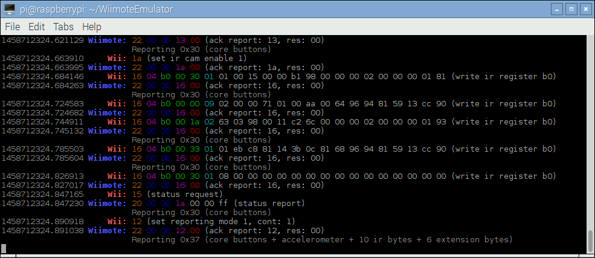

# BetterWM

# Fork of WiimoteEmulator with a better UI/UX

Emulates a Bluetooth Wii controller in software.

### Features

  - Emulate the Wiimote's many features and extensions
  - Allows use of different input devices (keyboard etc.)

### Build/Install

The following dependencies/packages are required (if not already installed):

  - libdbus-1-dev
  - libglib2.0-dev
  - libsdl1.2-dev

Run the build script (in the project directory):

  > source ./build-custom.sh

For more information on the build script, see [this explainer](https://github.com/rnconrad/WiimoteEmulator/blob/master/CustomBuild.md).

### Using the Emulator

Stop any running Bluetooth service, e.g.:

  > sudo service bluetooth stop

Start the custom Bluetooth stack (e.g. from the project directory):

  > sudo ./bluez-4.101/dist/sbin/bluetoothd

Run the emulator (in the project directory):

  > ./wmemulator

With no arguments, the emulator will listen for incoming connections (similar to
syncing a real Wiimote). Pressing the sync button on a Wii should cause it to
connect.

You can also supply the address of a Wii to directly connect to it as long as
you have connected to it before (or you change your device's address to the
address of a trusted Wiimote).

  > ./wmemulator XX:XX:XX:XX:XX:XX

You will need to run the custom Bluetooth stack (as described above) whenever
using the emulator (it won't persist after e.g. a device restart). Also, the
custom stack generally won't be useful for anything besides Wiimote emulation.

To stop the custom stack and restore the original Bluetooth service, e.g.:

  > sudo killall bluetoothd

  > sudo service bluetooth start
